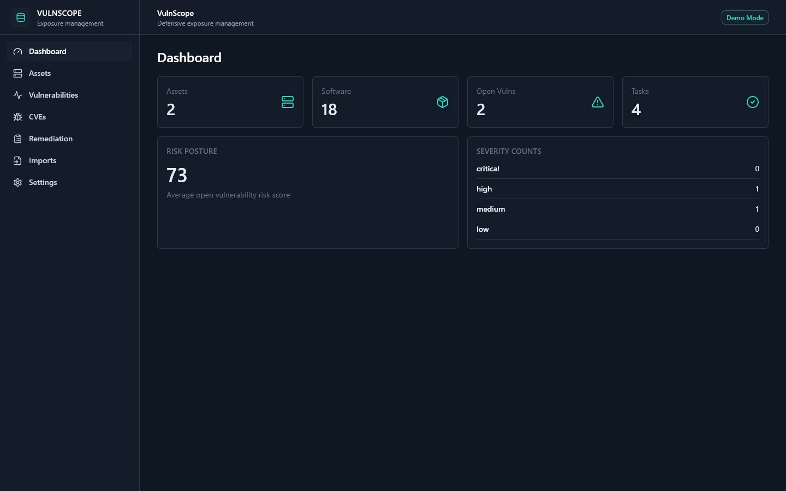
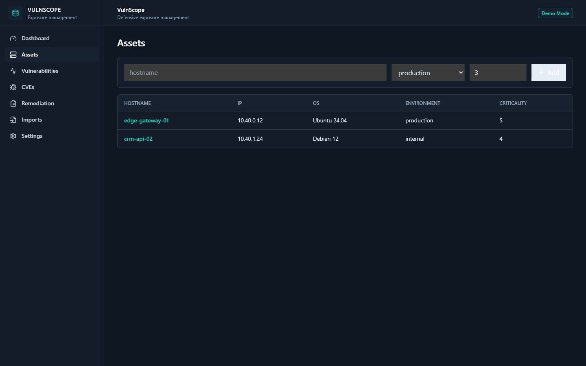
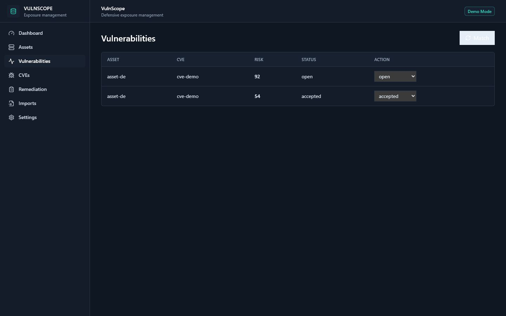

# VulnScope V1.0
Vulnerability exposure management dashboard for assets, software inventory, CVEs and remediation tracking.

## Product Overview

VulnScope is the KRYNEX Labs public MVP for defensive exposure management. It demonstrates how assets, installed packages, CVEs, vulnerability matches, imports and remediation tasks can be managed in one enterprise dashboard. The public version is a demo/portfolio build, not a production scanner.

## Key Features

- Asset and software inventory views.
- CVE catalog and vulnerability matching workflow.
- Remediation task tracking.
- Import records for already-collected defensive inventory data.
- Demo mode for dashboard preview without registration.

## Architecture

React/Vite frontend communicates with a FastAPI API. PostgreSQL stores organizations, users, assets and vulnerability data. Redis/Celery can support async import work.

## Tech Stack

- Frontend: React, TypeScript, Vite, TailwindCSS
- Backend: FastAPI, SQLAlchemy, Alembic
- Data: PostgreSQL, Redis
- Packaging: Docker Compose

## Screenshots



| List view | Detail view | Settings |
| --- | --- | --- |
|  |  |  |

## Quick Start

```bash
cp .env.example .env
docker compose up --build
```

Frontend: <http://localhost:5173>  
API: <http://localhost:8000/docs>

## Demo Mode

Set `DEMO_MODE=true` and `VITE_DEMO_MODE=true` for public demos. The frontend bypasses the login wall for dashboard preview. When demo mode is off, normal auth remains active.

## Public Demo Readiness

- Use synthetic asset names, IP ranges and package inventories in public demos.
- Keep imports limited to local demo files, never live customer inventory.
- Present remediation tasks as workflow examples rather than production SLAs.
- Reset demo state before sharing long-lived public review links.

## Environment Variables

Use `.env.example` as the public-safe template. Do not commit real secrets. Key variables include `DEMO_MODE`, `SECRET_KEY`, `DATABASE_URL`, `REDIS_URL`, `CORS_ORIGINS`, `VITE_API_BASE_URL` and `VITE_DEMO_MODE`.

## API Overview

- `/auth/login`, `/auth/register`, `/me` - normal local auth when demo mode is off.
- `/dashboard/stats` - dashboard metrics.
- `/assets`, `/software`, `/cves`, `/vulnerabilities`, `/remediation`, `/imports` - exposure management resources.

## Project Structure

```text
backend/      FastAPI API, models and migrations
frontend/     React dashboard
dev-local-api.js
docker-compose.yml
```

## Security Scope

VulnScope is defensive-only. It correlates inventory and CVE metadata. It does not perform unauthorized scanning, exploitation, credential access, stealth, persistence or destructive actions.

## Roadmap

### Already implemented

- FastAPI and React public demo for assets, software inventory, CVEs and remediation tasks.
- C++ risk engine path for vulnerability matching and score calculation with safe fallback.
- C++ remediation SLA triage mode for overdue, due-soon and on-track exposure workflows.
- C++ executive exposure summary mode for portfolio risk, urgent items and open workload.
- C++ SLA backlog summary mode for overdue and due-soon remediation queues.
- C++ remediation priority helper for P0-P3 queue ordering.
- C++ priority mix summary for executive remediation workload charts.
- Production guards for secrets, CORS and demo-mode boundaries.
- Password-strength validation and smoke-tested forced C++ analysis path.

### Will be implemented

- Richer demo import datasets for synthetic assets and package inventories.
- Frontend widgets for executive exposure, SLA backlog, priority mix and remediation queue views.
- Read-only public demo controls and hosted deployment profile.
- Broader API and UI smoke tests for inventory and remediation workflows.

## KRYNEX Ecosystem

VulnScope pairs with SentinelX, LogForge and ThreatVault. Future KRYNEX Nexus may provide shared tenant, billing and control-plane workflows.

## License

MIT.
<!-- Project version: VulnScope V1.0 -->


